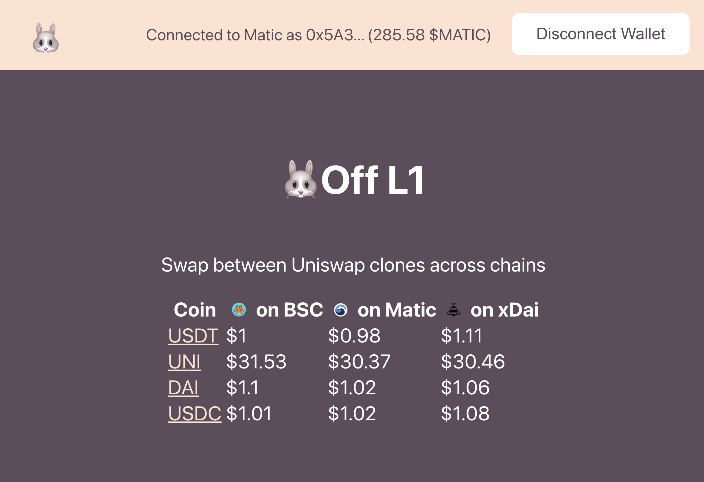

# 🐰 Off L1



1 click cross chain Uniswap clone arbitrage app.

- [Explainer video](https://www.youtube.com/watch?v=LELEh4aOzM4&)
- [Slide](https://speakerdeck.com/makoto_inoue/off-l1)
- [Demo site](http://offl1.surge.sh)

## How to set up

```
git clone https://github.com/makoto/off-l1
cd  off-l1/packages/react-app
yarn
yarn start
```

## API used

- [Connext](https://connext.network/) = State channel based cross chain bridge technoloy.
- [TheGraph](https://thegraph.com/) to call each chain's token prices
- [Web3 Modal]() = to allow you to connect via Metamask, Walletconnect, and Portis. WARNING: Do you access via smartcontract based wallet like Argent and Gnosis safe, as their wallet address is not compatible across different chains.
- [Portis](https://portis.io/) = Portis supports both xDAI and Matic (not BSC yet). To connect to the specific chain, go to the swap page (/exchange/*), then disconnet/connect

## Credits

Special thanks to [Rahul Sethuram](https://twitter.com/rhlsthrm) for the tireless support as well as actively contributing to the project